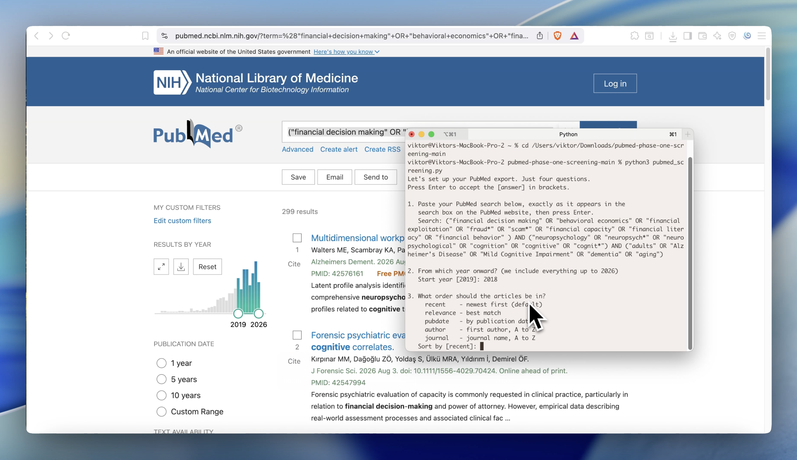

# PubMed Phase 1 Screening Export

**Turn a PubMed search into a spreadsheet with one command.** No accounts, no keys, nothing to install.

<a href="https://youtu.be/ZMCdlQ_UhwQ">
  
</a>

▶️ **[Watch the 1-minute walkthrough](https://youtu.be/ZMCdlQ_UhwQ)**

## What it does

This tool searches [PubMed](https://pubmed.ncbi.nlm.nih.gov/) for you and saves every match to a CSV, with authors, title, abstract, journal, year, DOI, and link all filled in. 

Open the CSV in Excel, Numbers, or Google Sheets and start screening. A real sample is in [`example_outputs/`](example_outputs/).

## Use it

You need **Python 3** (already on Mac and Linux; [get it here](https://www.python.org/downloads/) on Windows).

1. Download this project (green **Code** button, then **Download ZIP**, then unzip).
2. Open a terminal in the folder that contains `pubmed_screening.py`.
3. Run:

```bash
python3 pubmed_screening.py
```

The tool then asks you **four simple questions**:

1. **Your search.** Build your search on the [PubMed website](https://pubmed.ncbi.nlm.nih.gov/) until the results look right, then copy it and paste it in. Whatever works there works here.
2. **From which year.** Type a starting year, like `2016`. The tool includes everything from that year up to today.
3. **What order.** Press Enter for newest first, or pick another order (best match, publication date, author, journal).
4. **Which columns.** Press Enter for all columns, or type `n` to keep just Authors, Title, and Abstract.

That's it. When it finishes, a file like `pubmed_screening_2026-08-13_194829.csv` appears in the folder. Open it in Excel, Numbers, or Google Sheets. Every run makes a new file, so nothing is ever overwritten.

## Good to know

- **How it works:** PubMed's own free service finds your matches and hands back their details. Handles up to 10,000 articles per run.
- **No results?** Try the search on the [PubMed website](https://pubmed.ncbi.nlm.nih.gov/) first. If it returns articles there, it will here too.

## For advanced users

You can skip the questions by passing options on the command line. Run `python3 pubmed_screening.py --help` to see them all: `--query`, `--start-year`, `--end-year`, `--sort`, `--simple`, `--output`, and `--email`.

## License

[MIT](LICENSE), free to use, change, and share.
